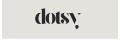

<p align="center">

</p>
<h3 align="center">Linux Config Backup and Restore</h3>
<br/>

[](https://ko-fi.com/O4O5HGOQY)

## Quickstart

- This project uses briefcase to packege

## Build from scratch

- This project uses [uv](https://docs.astral.sh/uv/), make sure it is installed

```
# Clone repository
git clone https://github.com/aamirazad/dotsy.git

# Change into project directory
cd dotsy

# Create virtual env and install dependencies
uv venv
uv sync

# Run Dotsy in virtual env
uv run python -m dotsy
```
